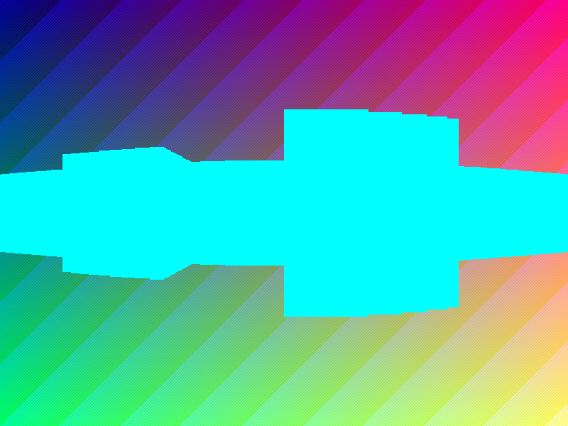
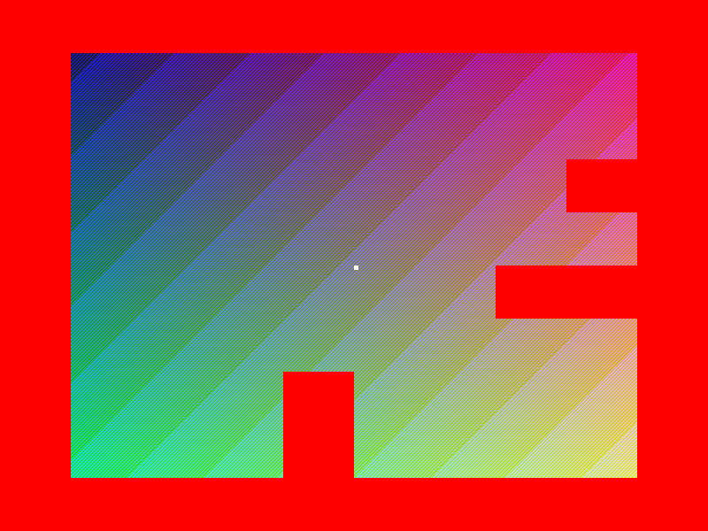

  

--- 

# What even is this?  

A 3D (not really) engine, *à la* Wolfenstein.  

Here is a screenshot:  

  

And here is how the map *actually* looks like (the white dot is the "player", looking straight to the right):  

  

---  

```
$ mkdir build && make
```  
